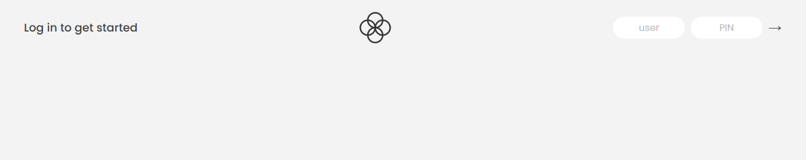
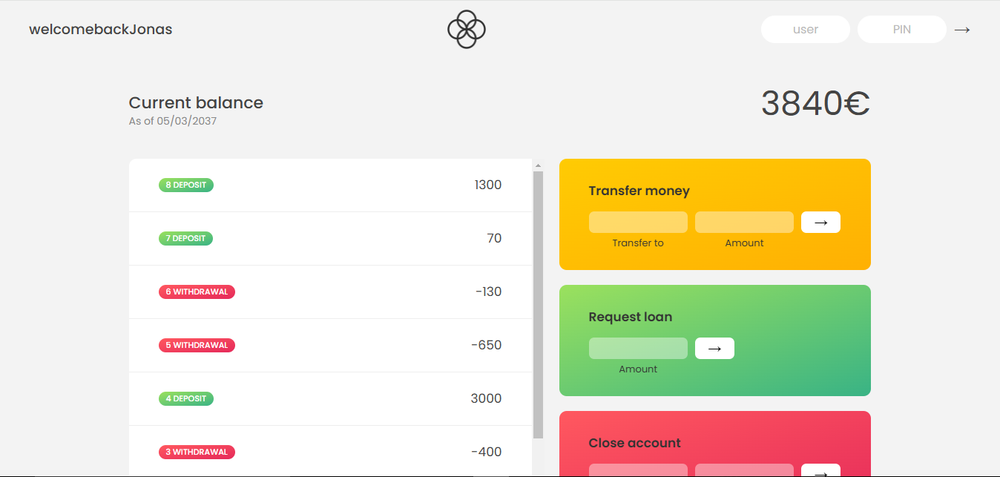

# Bankist Application

## Overview

The Bankist application is a modern banking interface designed to simulate real-world banking operations. It provides users with a secure and intuitive platform to manage their finances. The application allows users to log in using a unique username and PIN, view their account balance, track transaction history, and perform various banking operations such as transferring money, requesting loans, and closing accounts.

## Key Features

- **User Authentication**: Secure login with a unique username and PIN.
- **Account Overview**: Real-time display of current balance and transaction history.
- **Transaction Management**: View deposits and withdrawals with detailed timestamps.
- **Money Transfer**: Easily transfer funds to other accounts.
- **Loan Requests**: Request loans directly from the application.
- **Account Closure**: Securely close your account with user confirmation.
- **Logout Timer**: Automatic logout for enhanced security after a period of inactivity.

## Tech Stack

- **Frontend**: HTML, CSS, JavaScript
- **Backend**: None (this is a frontend-only application)
- **Version Control**: Git

## Installation and Setup

To run the Bankist application locally, follow these steps:

1. **Clone the Repository**:

   ```bash
   git clone https://github.com/Jatinsharma43/Bankist-Application.git
   cd bankist-app
   ```

2. **Usage**:
   - Log in using the following demo accounts:
     - Username: `js`, PIN: `1111`
     - Username: `jd`, PIN: `2222`
   - Explore the features such as viewing balance, transferring money, requesting loans, and closing accounts.

## Cloning Instructions

To clone this repository and set up the project on your local machine, use the following command:

```bash
git clone https://github.com/your-username/bankist-app.git
```

## Contributing

Contributions are welcome! If you'd like to contribute to the Bankist application, please follow these steps:

1. Fork the repository.
2. Create a new branch (`git checkout -b feature/YourFeatureName`).
3. Commit your changes (`git commit -m 'Add some feature'`).
4. Push to the branch (`git push origin feature/YourFeatureName`).
5. Open a pull request.

## Acknowledgments

- Inspired by modern banking applications.
- Built as part of a JavaScript course by jonas schmedtmann to demonstrate frontend development skills.

## Screnshots




